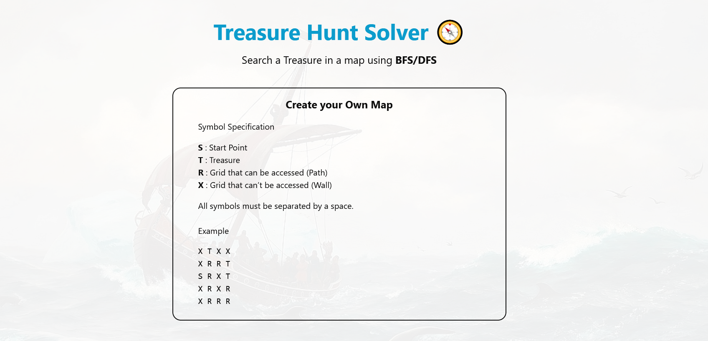
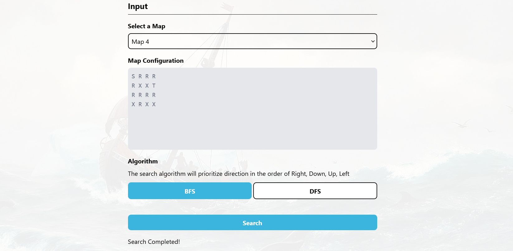
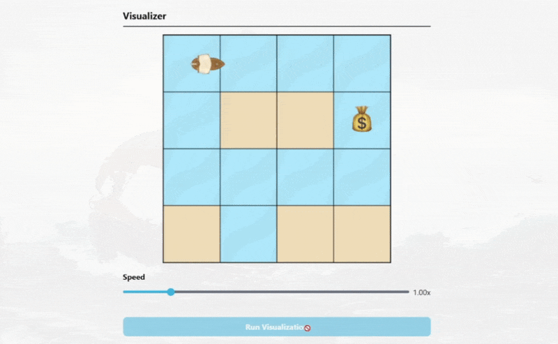

<h1 align="center">Treasure Hunt 🧭 BFS-DFS Algorithm Visualization</h1>

> This project is part of my CS202 Challenge. More details about it on [my website](https://cadevue.com)! (updated soon)

# Try Now!
This application can be tried out immediately! The web application can be accessed in this link:  
https://treasure-hunt-lake.vercel.app/

# Project Description 
A web application that solve the treasure hunt problem using Breadth First Search (BFS) and Depth First Search (DFS) algorithm. The application visualize how a ship traverse the ocean (grid-based) map to find the treasure using the two algorithms.

The technologies used for the application are:
- **React** as the frontend framework
- **Typescript** as the language
- **Vite** for the frontend bundler
- **TailwindCSS** for the styling
- **Vercel** for the deployment

# Deployment
The web application can be accessed in this link:  
https://treasure-hunt-lake.vercel.app/

# Screenshots 
Here are some screenshots of the treasure hunt application.

### Instruction

### Input Section

### Algorithm Visualization

### Result Summary
